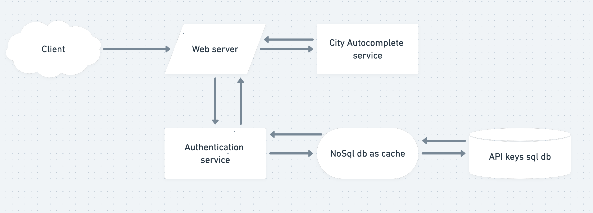

# City Autocomplete API

## Introduction
The purpose of this exercise is to provide an API returning a city autocomplete suggestions based on a received prefix.
Giving as a result all possible cities, along with their respective state, country, latitude, longitude, and a score
representing the probability the suggested city is correct.

## Built using
* [Java 11 (Correto 11)](https://docs.aws.amazon.com/corretto/latest/corretto-11-ug/downloads-list.html) - Programming Language
* [Spring Boot](https://spring.io/projects/spring-boot) - Web framework
* [Maven](https://maven.apache.org) - Dependency management, task manager and scripting library
* [Simple maps](https://simplemaps.com/data) - USA and Canada cities data provider

## Getting Started
### This project doesn't use any third party service, nor does it make http requests to any other service. Therefore it is not necessary to have an internet connection to correctly run and use the project.

As a Spring boot project, it already has all the configurations needed to be a "Download and Run" project.
It has a Tomcat embedded server, which makes this a simple bootable project.
If it is downloaded as source code, just run the "main" method, as a common Java project.
It can also be built to create a Jar file and make it runnable from any computer with a JVM installed.
To do so, run the maven task: *package*. Which will create a Jar file located in: `./target/name_of_build.jar`
This jar file is completely bootable from any JVM 11. To do so run:
```
$ java jar  name_of_build.jar.jar
```

## Rest API
* A more detailed API documentation can be consulted at: /swagger-ui.html

#### Account Endpoints
| URI | Method  | Description |
| ------------- | ------------- | ------------- |
| /suggestions  | GET  | Get all possible cities
#### Query string parameters
| Parameter | Type | Description | Optional | Example |
| ------------- | ------------- | ------------- | ------------- | ------------- |
| q  | String  | City prefix to search |  🚫 | Montre
| latitude  | double  | Optional latitude for better search |  ✅ | 42.13
| longitude  | double  | Optional longitude for better search |  ✅ | -98.19
| state  | String  | Optional state code for better search |  ✅ | QC
| country  | String  | Optional country name for better search |  ✅ | Canada
#### Sample requests URI examples
* /suggestions?q=Montre
* /suggestions?q=Montre&state=QC
* /suggestions?q=Montre&latitude=43.70011&longitude=-79.4163
* /suggestions?q=Montre&latitude=43.70011&longitude=-79.4163&country=Canada&state=QC


## How search works?
#### Trie as main data structure
In order to perform the search effectively, a Trie data structure is used.
A Trie is an n-ary tree where each of its nodes is commonly a character. When all the nodes finish creating a word,
the last node is marked to know that a word has been found.

Searching and inserting words through a Trie is quite optimal, since time complexity for both, inserting and searching
is O(n), where "n" is the length of the longest string.

TrieNode and Trie classes are implemented from 0 and can be found in `com/edgar/citiessuggester/DataStructures`
Trie class is defined as "singleton" since only one Trie instance is needed in the complete program.
In order to save cities data with the same name, if a node is marked as "isWord", the node will store all the data
of the cities with the same name as ArrayLists.
So if the name of a city exists in different places, there is only one path in the Trie for that specific name. At the end of
the path, ArrayLists will be found containing data of each city.

The `AutocompleteService` class is dedicated to searching, formatting and sorting all possible results.
Once a search is requested, all cities with same prefix, will be returned as an ArrayList of HashMaps, regardless of its score . Where each hashmap
contains data from all cities with the same name.

#### Project setup
Original CSV with data of USA and Canadian cities were obtained from [Simple maps](https://simplemaps.com/data).
These CSVs are in `/resources/data`

Once the project starts running, the `constructTrie` method in `CreateTrie` class starts running after
the project construction has finished.
The purpose of this method is to take the name of each city and create a single Trie.


## How is score calculated?
The `ScoringService` class is dedicated to calculate the score of each result.

5 parameters are consider to get the final score:
* Closeness of latitude
* Closeness of longitude
* Are they in the same state/province?
* Are they in the same country?
* Characters length difference between prefix and city name

Since the maximum probability that the searched and suggested cities are the same is 100, each of the parameters
gives 20 points.
* The closer their latitudes are, the more points near 20 it will receive.
* The closer their longitudes are, the more points near 20 it will receive.
* If both cities are in the same country, but the state/province is unknown, it will receive 20 points.
* If both cities are in the same state/province, they will automatically receive 40 points as they are also in the same country.
* The closer the difference between theirs names length, the more points near 20 it will receive.

Once al the possible points are calculated, they are divided by 100 and 2 decimal places of accuracy are left.


## API keys design for future services

When an http request is made to the server, it is first verified the key sent is an existing key within the database.
If it is a valid key, a non-sql database record is stored for a limited time as a cache memory to speed up future requests.

If a valid key is returned, a request is made to the existing autocomplete service. The response from the autocomplete
service is returned to the client.

If the key is invalid, it is not cached and a response with status 401 is returned.


